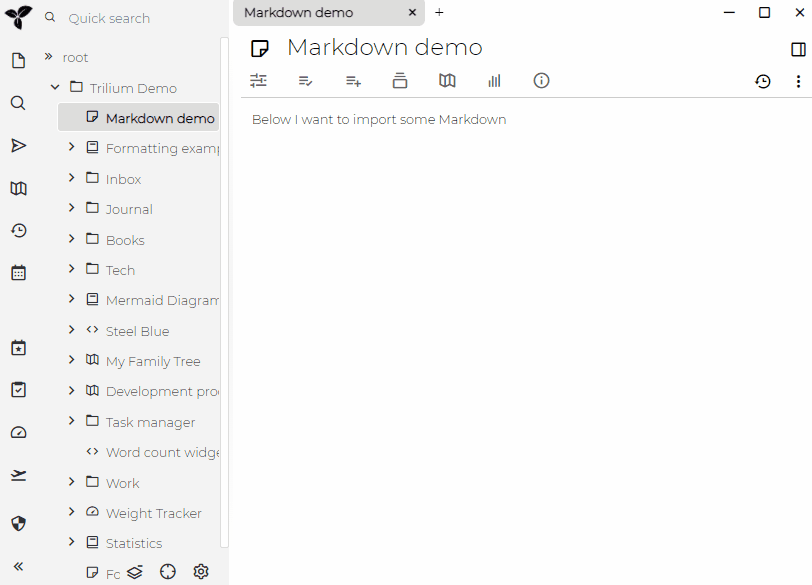
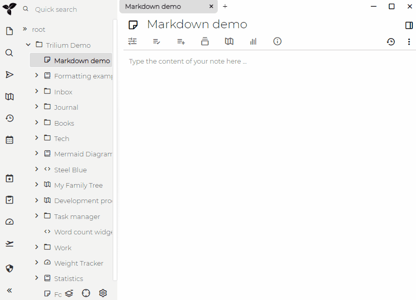
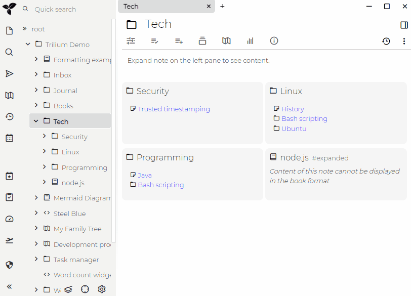
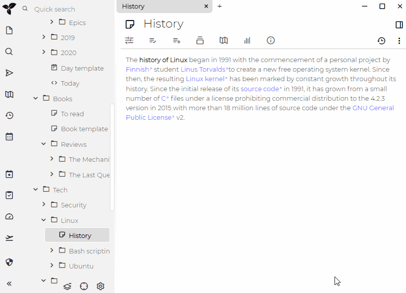

# Markdown
Trilium supports Markdown for both import and export, while trying to keep compatibility as high as possible.

## Import

### Clipboard import

If you want to import just a chunk of markdown from clipboard, you can do it from editor block menu:

### File import

You can also import Markdown files from files:

*   single markdown file (with .md extension)
*   whole tree of markdown files (packaged into [.zip](https://en.wikipedia.org/wiki/Tar_\(computing\)) archive)
    *   Markdown files need to be packaged into ZIP archive because browser can't read directories, only single files.
    *   You can use e.g. [7-zip](https://www.7-zip.org) to package directory of markdown files into the ZIP file

\[\[gifs/markdown-file-import.gif\]\]

## Export

### Subtree export

You can export whole subtree to ZIP archive which will have directory structured modelled after subtree structure:

### Single note export

If you want to export just single note without its subtree, you can do it from Note actions menu:

### Exporting protected notes

If you want to export protected notes, enter a protected session first! This will export the notes in an unencrypted form, so if you reimport into Trilium, make sure to re-protect these notes.

## Supported syntax

*   [GitHub-Flavored Markdown](https://github.github.com/gfm/) is the main syntax that Trilium is following.
*   Images are supported. When exporting, images are usually kept in the basic Markdown syntax but will use the HTML syntax if the image has a custom width. Figures are always embedded as HTML.
*   Tables are supported with the Markdown syntax. If the table is too complex or contains elements that would render as HTML, the table is also rendered as HTML.
*   <a class="reference-link" href="../../Note%20Types/Text/Admonitions.md">Admonitions</a> are supported using GitHub's format.
*   Links are supported. “Reference links” (internal links that mirror a note's title and display its icon) are embedded as HTML in order to preserve the information on import.
*   Math equations are supported using `$` and `$$` syntaxes.